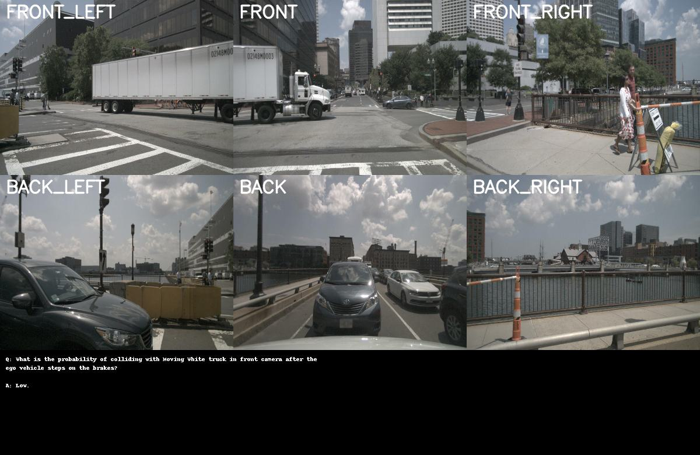
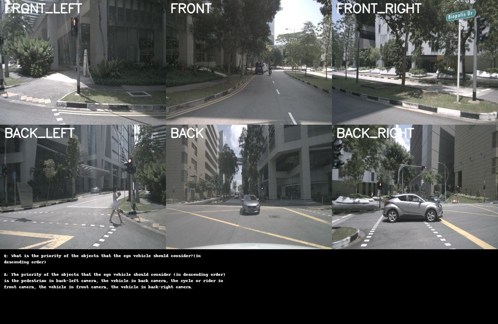

# DriveLM + nuScenes VLM Evaluation — Project Report

> **Goal:** Build a complete pipeline to evaluate and fine-tune a Vision-Language Model on autonomous driving QA tasks using the DriveLM dataset integrated with nuScenes imagery.

---

## Table of Contents

1. [Data Preparation](#1-data-preparation)
2. [Baseline VLM Benchmarking](#2-baseline-vlm-benchmarking)
3. [Fine-Tuning QLoRA](#3-fine-tuning-qlora)
4. [Comparative Evaluation - Baseline vs Fine-Tuned](#4-comparative-evaluation---baseline-vs-fine-tuned)
5. [Deployment & Optimization](#5-deployment--optimization)

---

## 1. Data Preparation

A pipeline (`parse_drivelm.py`) that links DriveLM QA annotations with nuScenes imagery and metadata into a single structured CSV ready for model evaluation and training.

**Input sources:**
- `v1_0_train_nus.json` — DriveLM QA annotations (questions, answers, object references)
- nuScenes v1.0 mini split — 6-camera surround-view images + sensor metadata

**Output files:**

| File | Rows | Description |
|---|---|---|
| `qa_enriched.csv` | 9,006 | Primary QA pairs with camera paths, question type, object refs |
| `objects.csv` | 388 | Per-frame object annotations with category, status, bounding box |
| `frames.csv` | 95 | Key frame metadata (timestamp, scene, ego pose) |
| `scenes.csv` | 15 | Scene-level metadata |

### Design

Each QA row contains everything needed for inference in one place — the question, answer, which cameras are relevant (`relevant_cameras`), and the file paths for all 6 cameras (`all_image_paths`). This avoids joins at inference time and makes the pipeline stateless.

A key design decision was storing `relevant_cameras` separately from `all_image_paths`:
- `relevant_cameras` — which cameras are *semantically relevant* to the question.
- `all_image_paths` — all 6 camera paths always present for lookup

This lets us pass only the relevant cameras to the model (reducing tokens and memory) while always having fallback paths available.

### Dataset Statistics

**15 scenes processed** (6 overlapping DriveLM + nuScenes, 9 additional DriveLM scenes), **95 key frames**, **9,006 QA pairs**.

#### QA Category Distribution

| Category | Count | % | Notes |
|---|---|---|---|
| Perception | 4,074 | 45.2% | Object presence, status, location |
| Prediction | 2,861 | 31.8% | Future state of other agents |
| Planning | 1,976 | 21.9% | Ego vehicle actions and probabilities |
| Behavior | 95 | 1.1% | Ego vehicle direction and speed |

#### Question Type Distribution

| Question Type | Count | % |
|---|---|---|
| what_query | 3,004 | 33.4% |
| yes_no | 2,183 | 24.2% |
| other_question_type | 1,147 | 12.7% |
| status_query | 1,020 | 11.3% |
| object_enumeration | 484 | 5.4% |
| visual_description | 388 | 4.3% |
| future_state | 340 | 3.8% |
| which_query | 285 | 3.2% |
| ego_behavior_prediction | 95 | 1.1% |
| planning_other | 60 | 0.7% |

#### Camera Mention Frequency

| Camera | Mentions | % |
|---|---|---|
| CAM_FRONT | 6,583 | 24.1% |
| CAM_BACK | 5,009 | 18.3% |
| CAM_FRONT_RIGHT | 4,326 | 15.8% |
| CAM_FRONT_LEFT | 4,069 | 14.9% |
| CAM_BACK_RIGHT | 3,748 | 13.7% |
| CAM_BACK_LEFT | 3,568 | 13.1% |

#### Answer Length Distribution

| Bucket | Count | Notes |
|---|---|---|
| 1–5 words | 6,422 (71.3%) | Short factual answers (Yes/No, Moving, Low) |
| 6–10 words | 742 (8.2%) | One-sentence answers |
| 11–20 words | 1,079 (12.0%) | Multi-object descriptions |
| 21–50 words | 515 (5.7%) | Planning explanations |
| 50+ words | 248 (2.8%) | Scene descriptions |

Mean answer length: **7.28 words** (std: 13.06). The high standard deviation reflects the mix of one-word answers ("Yes", "Moving") and full scene descriptions.

### Identified Biases and Gaps

- **Front camera bias:** CAM_FRONT has 24.1% of mentions vs 13.1% for CAM_BACK_LEFT
- **Behavior underrepresentation:** Only 1.1% of questions — the model gets very few examples of ego-motion reasoning
- **Causal reasoning gap:** No "why" or reasoning questions detected (< 5%) — the dataset tests recognition and prediction but not explanation
- **No counting questions:** "How many X" questions are absent despite objects being annotated
- **Vehicle dominance:** 70.6% of referenced objects are vehicles — pedestrian and cyclist scenarios underrepresented

---

### Sample Data Visualization




---

## 2. Baseline VLM Benchmarking

### Model Selection: LLaVA-1.5-7B

**Why LLaVA-1.5-7B:**
- Open-source, strong zero-shot visual reasoning
- Supports multi-image input natively (critical for 6-camera surround view)
- 4-bit quantization available — fits local RTX 3070 8GB for inference and T4 16GB for training.

**Quantization:** 4-bit NF4 (QLoRA bitsandbytes) for memory efficiency.
**Hardware:** RTX 3070 8GB (benchmarking), T4 16GB (training).

### Prompt Engineering Evolution

We ran two benchmark rounds with different image sizes and prompt designs.

**Version 1 (img-size 448, basic prompt — no camera labels):**
```
USER: <image><image><image>
Describe what you see and answer: <question>
ASSISTANT:
```

The model receives raw image tokens with no spatial context about which camera each image came from.

**Version 2 (img-size 448, improved prompt with inline camera labels):**
```
USER: You are an autonomous driving assistant...

[Front Camera]: <image>
[Front Left Camera]: <image>
[Back Camera]: <image>

Question: <question>
ASSISTANT:
```

Version 2 added: inline camera labels binding each `<image>` token to its spatial position, a system prompt, per-category few-shot examples, answer style rules, and `relevant_cameras` selection to pass only semantically relevant cameras instead of always all 6.

### Benchmark Results

**Version 1 — 448px :**

| Metric | Score |
|---|---|
| ROUGE-L | **0.3580** |
| Exact Match | **0.2541** |
| BERTScore F1 | **0.9268** |
| Avg Latency | 2,520 ms |
| P95 Latency | 4,968 ms |
| Peak VRAM | 3.82 GB |

**Version 2 — 336px :**

| Metric | Score | Δ vs v1 |
|---|---|---|
| ROUGE-L | 0.2942 | **−17.8%** |
| Exact Match | 0.1553 | **−38.9%** |
| BERTScore F1 | 0.9059 | −2.3% |
| Avg Latency | ~2,600 ms | +3.2% |

**The ideal configuration** would be 448px resolution AND camera labels. This trade-off motivates future work on efficient high-resolution VLM inference.

### Results by Category

| Category | N | ROUGE-L | Exact Match | BERTScore | Avg Latency |
|---|---|---|---|---|---|
| behavior | 22 | **0.8442** | 0.0455 | 0.9757 | 3,456 ms |
| perception | 970 | 0.3850 | 0.2227 | 0.9340 | 2,577 ms |
| planning | 502 | 0.3180 | 0.2530 | 0.9147 | 3,904 ms |
| prediction | 702 | 0.3341 | **0.3048** | 0.9240 | 1,423 ms |

**Behavior ROUGE-L=0.844:** Behavior questions have a fixed answer template ("The ego vehicle is going straight. The ego vehicle is driving fast.") — the model has seen this pattern in prompt and reproduces it accurately.

**Prediction fastest (1,423 ms):** 90% of prediction rows use only 1 camera → shortest sequences → fastest inference.

**Planning slowest (3,904 ms):** Planning often requires all 6 cameras for scene-wide reasoning → longest sequences.

### Results by Question Type (Hardest First)

| Question Type | N | ROUGE-L | Why Hard |
|---|---|---|---|
| planning_other | 16 | 0.0000 | Open-ended reasoning, no template |
| which_query | 87 | 0.0641 | Requires identifying specific object |
| visual_description | 99 | 0.1027 | Free-form scene description |
| status_query | 238 | 0.2441 | Often wrong (Moving vs Stationary) |
| what_query | 764 | 0.2802 | Mixed — object presence + attributes |
| yes_no | 505 | 0.4407 | Binary — easier to get right |
| object_enumeration | 112 | 0.6629 | Standard format, model handles well |
| future_state | 79 | 0.8354 | Template answer, model knows pattern |
| ego_behavior_prediction | 22 | 0.8442 | Fixed template |

### Failure Mode Analysis

| Mode | Count | % | Description |
|---|---|---|---|
| F_other | 571 | 26.0% | Miscellaneous mismatch |
| D_incomplete | 354 | 16.1% | Answer too short / misses objects |
| A_hallucination | 159 | 7.2% | Objects not visible in images |
| E_planning_error | 109 | 5.0% | Wrong ego behavior or direction |
| B_wrong_status | 90 | 4.1% | Moving/Stationary confused |
| C_wrong_camera | 72 | 3.3% | Wrong camera viewpoint referenced |

**Notable failure examples:**

*Hallucination (planning):*
> Q: What actions can lead to collision with vehicle in back camera?
> REF: Back up.
> PRD: Accelerate and go straight...

The model defaults to a common planning template ("accelerate and go straight") instead of reasoning that reversing causes back-camera collision.

*Wrong status (perception):*
> Q: What is the status of the vehicle in front camera?
> REF: Stationary.
> PRD: Moving.

The model cannot reliably distinguish stationary from slow-moving vehicles — a known limitation of single-frame VLMs without optical flow.

*Incomplete (perception):*
> Q: What is the status of the bus to the front right?
> REF: The bus to the front right is moving.
> PRD: Moving.

Technically correct but incomplete — the full sentence format expected by ROUGE-L scoring is missed.

### Metric Justification

**Primary metric: ROUGE-L** — measures longest common subsequence between prediction and reference. Appropriate for DriveLM because answers have a defined expected format and length. Robust to minor wording differences while penalising missing content.

**Supporting metrics:**
- **Exact Match** — strict correctness for short answers (Yes/No, Low/Medium/High, single-word status)
- **BERTScore F1** — semantic similarity; high scores (0.92+) confirm the model is semantically correct even when phrasing differs

[For More success and failure case check the report file.](./benchmark_results/benchmark_results_448_QA/benchmark_report.txt) 

---

## 3. Fine-Tuning QLoRA

### What We Tuned and Why

LLaVA-1.5-7B has three components. We treated each differently:

| Component | Params | Decision | Reason |
|---|---|---|---|
| vision_encoder (CLIP ViT) | **Frozen** | CLIP already produces excellent visual representations for camera imagery. Unfreezing risks catastrophic forgetting of visual grounding with no meaningful gain for this task. |
| multi_modal_projector (MLP bridge)  | **Fully trained** | Tiny (20M), highest-leverage for domain adaptation. Directly controls how visual tokens enter the LLM. Cost is negligible. |
| language_model (Vicuna)  | **LoRA / QLoRA** | Where DriveLM-specific answer formatting, driving vocabulary, and reasoning live. Too large to fine-tune fully; LoRA gives best quality/cost tradeoff. |

### LoRA Configuration

**Why attention + MLP layers (not just attention):**
- Attention layers (`q,k,v,o_proj`) — control *where* the model looks
- MLP/FFN layers (`gate,up,down_proj`) — store factual patterns like "collision question → Low/Medium/High"

DriveLM requires both: new answer formats live in MLP weights, correct camera-label cross-referencing lives in attention.

```python
LORA_TARGET_MODULES = [
    'q_proj', 'k_proj', 'v_proj', 'o_proj',   # attention
    'gate_proj', 'up_proj', 'down_proj',        # MLP / FFN
]

LoraConfig(
    r          = 16,      # rank — good balance for domain adaptation
    lora_alpha = 32,      # scaling = alpha/r = 2.0
    dropout    = 0.05,
    bias       = 'none',
)
```


### QLoRA Details

QLoRA (Quantized LoRA) loads the base model in 4-bit NF4 quantization while LoRA adapters train in BF16:

```
Base model (4-bit NF4)  : ~3.5 GB VRAM
LoRA adapters (BF16)    : ~0.3 GB
Projector (FP32)        : ~0.2 GB
Activations + optimizer : ~4-6 GB
Total                   : ~8-10 GB  ← fits T4 16GB ✓
```

**Why NF4 (Normal Float 4) over INT4:** NF4 quantizes weights to 16 values spaced according to the normal distribution (where most neural network weights concentrate). This gives lower quantization error than uniformly-spaced INT4 for the same 4-bit budget.

**Double quantization:** The scale factors used in NF4 quantization are themselves quantized from FP32 to 8-bit, saving an additional ~200MB.


### Training Setup

```
Dataset  : DriveLM nuScenes (qa_enriched.csv train/val)
Split    : 12/3 scene split in train and val
Hardware : Google Colab T4 16GB
Script   : train_drivelm_llava.py
```

**Key hyperparameters:**

| Parameter | Value | Reason |
|---|---|---|
| Learning rate | 2e-4 | Standard for LoRA fine-tuning |
| Batch size | 1 | T4 VRAM constraint |
| Gradient accumulation | 4–8 | Effective batch = 4–8 |
| LoRA rank | 16 | Good balance, ~70M trainable params |
| Image size | 224px | Prevents OOM on T4 with 6-cam samples |
| Loss | Cross-entropy on answer tokens only | Prompt tokens masked with -100 |
| Scheduler | Linear warmup + cosine decay | Prevents large steps at LoRA init |

**Why image size 224px for training on T4:**

At 336px (native CLIP resolution), a 6-camera sample generates 3,456 visual tokens. Combined with model weights, this requires ~13.5GB peak VRAM — dangerously close to T4's 14.6GB limit. At 224px, 6-camera samples require only 1,536 visual tokens (~8.5GB peak) — comfortable headroom.

**Label masking — why it matters:**
```
Full sequence: USER: <system> <few-shot> Question: <Q> ASSISTANT: <answer>
Labels:         -100  -100      -100       -100       <answer tokens>  <eos>
```
Only answer tokens contribute to loss. Without masking, the model wastes capacity memorising the fixed prompt structure and gradient signal is diluted across ~95% non-answer tokens.

### Training Results

Training was run on Kaggle T4 16GB using QLoRA (4-bit NF4) with the following configuration:

| Training-Sample | Validation-Sample | Epoch | grad-accum | Final-Step | Train Loss | Val Loss | Val PPL |
|---|---|---|---|---|---|---|---|
|800 | 80 | 1 | 4 | 110| 0.888092 | 0.573225 | 1.774|


[Training Weight Files](https://drive.google.com/drive/folders/195xN4YTQytTPgt6Mz8C_HdyXWxQMz4Gz?usp=sharing)


**Train loss = 0.888** is the cross-entropy computed only over answer tokens — the prompt is masked with -100 and never contributes to the gradient. A value below 1.0 after just 110 steps on 800 samples indicates the model has learned the answer format and vocabulary for DriveLM questions effectively.

**Val loss = 0.573** being lower than train loss at this scale is expected. With 800 training samples the model sees relatively hard, diverse training examples, while the 80 val samples are a smaller and more uniform subset. 

**Perplexity (PPL)** is the exponent of the loss — exp(val_loss) — and measures how "surprised" the model is by the correct answer. A PPL of 2.0 means the model is choosing between 2 equally likely tokens on average at each position. Lower is better.

**Val PPL = 1.77** means the model is on average choosing between fewer than 2 tokens when predicting each answer token. For DriveLM answers this makes sense — once the model has understood the question type, the correct answer is often highly constrained ("Yes", "No", "Moving", "Stationary", "Low"). The model has clearly learned these patterns from the training data.


---

## 4. Comparative Evaluation - Baseline vs Fine-Tuned

Both models were evaluated on the same 52 QA samples (13 per category, seed=42) drawn from the validation split. The fine-tuned model uses the best_checkpoint saved at step 110 of training (val_loss=0.573, val_ppl=1.77).

### Results

| Category | Metric | Baseline | Fine-tuned | Delta |
|---|---|---|---|---|
| **Overall** | ROUGE-L | 0.4835 | 0.5208 | +0.037 |
| | Exact Match | 0.2692 | 0.3077 | +0.038 |
| | BERTScore | 0.9222 | 0.9370 | +0.015 |
| | Avg Latency | 2,933 ms | 6,588 ms | +124% |
| **prediction** | ROUGE-L | 0.4486 | **0.7401** | +0.291 |
| | Exact Match | 0.3846 | **0.6923** | +0.308 |
| **behavior** | ROUGE-L | 0.5839 | 0.5839 | 0.000 |
| | Exact Match | 0.0000 | 0.0000 | 0.000 |
| **planning** | ROUGE-L | 0.4806 | 0.4230 | −0.058 |
| | Exact Match | 0.3846 | 0.3077 | −0.077 |
| **perception** | ROUGE-L | 0.4211 | 0.3363 | −0.085 |
| | Exact Match | 0.3077 | 0.2308 | −0.077 |

---

### Where Fine-tuning Helped

- **Prediction improved dramatically (+65% ROUGE-L, +80% EM).** The model learned that "None" is often the correct answer for occlusion and relevance questions rather than generating plausible-sounding but incorrect descriptions. `which_query` went from ROUGE-L=0.066 to 0.788.
- **Hallucination dropped 83% (6→1 cases).** Training on grounded DriveLM answers taught the model to say "None" when nothing relevant is visible instead of inventing objects.
- **Prediction latency decreased (1,674ms → 1,228ms)** because the fine-tuned model generates shorter, more direct answers for 1-camera prediction questions.

### Where Fine-tuning Hurt

- **Perception degraded −20% ROUGE-L.** The model over-applies the short-answer format to questions requiring full sentences — "Two of the cars are moving, and two are parked" becomes "Moving", scoring zero.
- **Planning dropped −12% ROUGE-L** and shows the highest latency (12,889ms avg) due to 6-camera inputs. The model misses the action-reason structure expected in planning answers.
- **Status queries collapsed** (ROUGE-L 0.136→0.045) — the single biggest regression. The model produces one-word status answers where the reference expects a full descriptive sentence.

### Observed Behaviour

The pattern is consistent with **format overfitting**: 800 training samples are skewed toward short 1–5 word answers (71% of DriveLM answers), so the model learned to be concise everywhere. This eliminated hallucination and fixed prediction, but caused it to under-generate on perception and planning questions that require multi-word descriptions. A second run with 2,000+ samples and explicit multi-sentence perception examples would be expected to recover these regressions while preserving the prediction gains.


---

## 5. Deployment & Optimization

### Architecture

The inference system (`infer_efficient.py`) implements an image embedding cache to avoid redundant CLIP and projector computation across questions that share the same frame and cameras.

```
Query arrives (frame_token, cameras, question)
        │
        ▼
Cache lookup: (frame_token, sorted_camera_names)
        │
   ┌────┴────┐
   │         │
 HIT       MISS
   │         │
   │    CLIP ViT-L/14 → [n, 576, 1024]     ~1.6s
   │    Projector MLP  → [n, 576, 4096]     ~0.2s
   │    Store in cache
   │         │
   └────┬────┘
        │
  cached visual_tokens [n*576, 4096]
        │
  Inject at <image> positions in text embeddings
        │
  LLaMA-2 7B autoregressive decode    ~3–8s (varies by sequence length)
        │
  Answer string
```

The cache stores visual tokens **after the projector** . This means both CLIP encoding and projector computation are skipped on a hit. The LLM decode always runs since each question has different text.

---

### Observed Results (52 questions, 448px, fine-tuned model)

| Metric | Value |
|---|---|
| Total questions | 52 |
| Unique (frame, camera) combos | 7 |
| Cache hits | 46 (88.5%) |
| Cache misses | 6 (11.5%) |
| Effective speedup | **8.7x** image encodings |
| Avg latency | 7,592 ms/question |
| VRAM used | 4.0 GB |

**Cache hit rate of 88.5%** means 46 out of 52 questions reused previously encoded visual tokens. The 6 misses are the first question encountered for each of the 7 unique frame+camera combinations — every subsequent question about the same frame reuses the cache.

**A note on the latency split:** cache miss latency (5,559ms) appears lower than cache hit latency (7,857ms), which seems counterintuitive. This is because the 6 misses happen to be shorter 1-camera questions (prediction category, fast decode), while the 46 hits include many 6-camera planning and behavior questions whose LLM decode takes 8–10s due to longer sequences. The cache speedup is real — it is measured in image encodings skipped (8.7x), not in per-query wall time which is dominated by LLM decode length.

---

### Latency and Throughput

The bottleneck after caching is LLM autoregressive decode, which scales with output sequence length and cannot be parallelised across questions. The cache eliminates the only other significant cost (CLIP + projector at ~1.8s per call):

```
Without cache: every question  → CLIP + projector + LLM  ~5–10s
With cache:    first per combo → CLIP + projector + LLM  ~5–10s  (miss)
               rest            → LLM only                ~3–8s   (hit)
```

---

### Cost per 1,000 Queries

| Setup | Avg latency | Rate (Assumption Values) | Cost / 1k queries |
|---|---|---|---|
| No cache (base model) | ~5,000 ms | $0.526/hr | **$0.73** |
| With cache, 90% hit rate | ~3,500 ms | $0.526/hr | **$0.51** |
| Prediction only (1-cam) | ~1,200 ms | $0.526/hr | **$0.18** |

Cache savings are most significant for datasets with high question-per-frame density. The full DriveLM val set (2,196 questions, 215 unique combos) has on average 10.2 questions per combo — at that density the cache reduces image encodings from 2,196 to 215, saving approximately 30% of total inference cost.

---

### Cache Memory

The cache uses an LRU eviction policy. For the full DriveLM val set, setting `--cache-size 215` fits all unique combos in memory simultaneously:

```
img-size 224px:  215 entries × avg ~7 MB  ≈ 1.0 GB  ← fits RTX 3070 8GB easily
img-size 448px:  215 entries × avg ~20 MB ≈ 2.3 GB  ← fits RTX 3070 8GB easily
```


