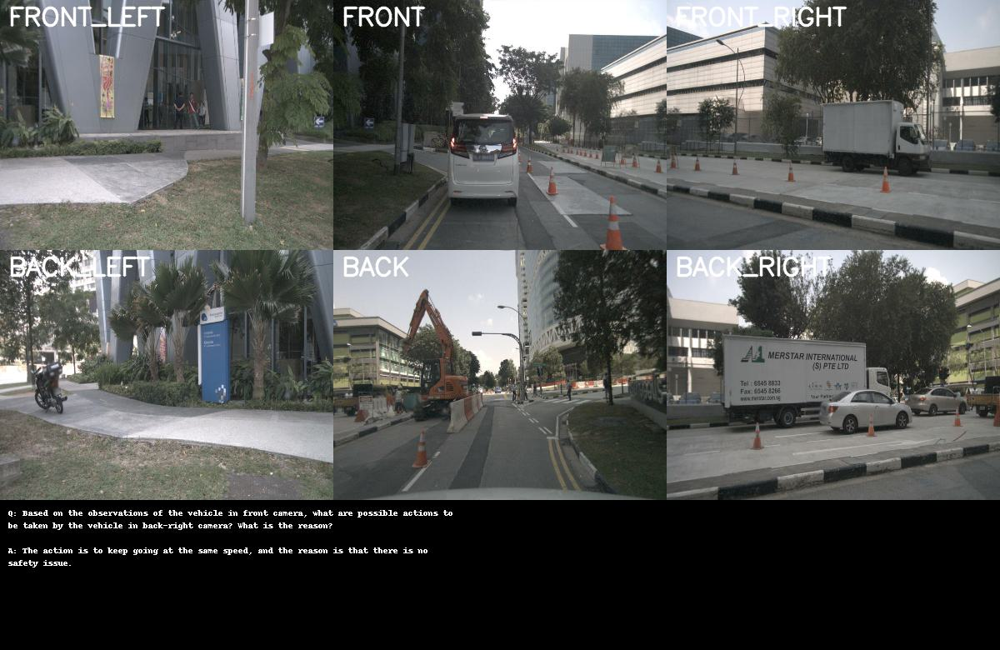

# DriveLM + nuScenes — VLM Evaluation and Fine-tuning

Evaluation and QLoRA fine-tuning pipeline for LLaVA-1.5-7B on the DriveLM autonomous driving QA dataset integrated with nuScenes imagery.

For a detailed explanation of design decisions, benchmark results, and analysis, see [PROJECT_REPORT.md](./PROJECT_REPORT.md).

---

## System Details

| Component | Specification |
|---|---|
| OS | Windows 11 |
| RAM | 16 GB |
| GPU (benchmarking) | NVIDIA RTX 3070 8GB or equivalent |
| GPU (fine-tuning) | NVIDIA T4 16GB (Colab / Kaggle) |
| CUDA | 12.1  |
| Python | 3.10 |

---

## Data Download

| Dataset | Source |
|---|---|
| DriveLM QA annotations | [v1_0_train_nus.json](https://drive.google.com/file/d/1LK7pYHytv64neN1626u6eTQBy1Uf4IQH/view) |
| DriveLM nuScenes images | [drivelm_nus_imgs.zip](https://drive.google.com/file/d/1DeosPGYeM2gXSChjMODGsQChZyYDmaUz/view) |
| nuScenes mini v1.0 | [nuscenes.org/download](https://www.nuscenes.org/nuscenes#download) |

Reference: [DriveLM data preparation guide](https://github.com/OpenDriveLab/DriveLM/blob/main/docs/data_prep_nus.md)

Place downloaded data under `./data/`:

```
data/
├── QA_dataset_nus/
│   └── v1_0_train_nus.json
└── nuscenes_v1.0/
    ├── samples/
    │   ├── CAM_FRONT/
    │   ├── CAM_BACK/
    │   └── ...
    ├── v1.0-mini/
    └── maps/
└── nuscenes/
    ├── samples/
    │   ├── CAM_FRONT/
    │   ├── CAM_BACK/
    │   └── ...
```

---

## Setup

### 1. Docker (recommended)

Build and run the container:

```bash
docker build -t drivelm .

docker run -it --gpus all \
  -p 8888:8888 \
  -v ~/workspace/assignment:/workspace/assignment \
  drivelm
```

### 2. Manual Install

```bash
pip install -r requirements.txt
```

---

## Jupyter Notebook (optional)

To explore the nuScenes dataset structure interactively:

```bash
# Inside the Docker container
jupyter notebook --ip=0.0.0.0 --port=8888 --no-browser --allow-root
```

Open `http://localhost:8888` in your browser.

Run the ./notebook/nuscenes_tutorial.ipynb

---

## Pipeline

### Step 1 — Parse and Data Analysis

Links DriveLM VQA annotations with nuScenes imagery and metadata into a single structured CSV.

```bash
python3 scripts/parse_drivelm.py ./data/QA_dataset_nus/v1_0_train_nus.json
```

**Input:** `v1_0_train_nus.json`, nuScenes metadata directory
**Output:** `drivelm_parsed/` folder

```
drivelm_parsed/
├── qa_enriched.csv       # 9,006 QA pairs — main file for all downstream steps
├── objects.csv           # 388 object annotations with bounding boxes
├── frames.csv            # 95 key frames with ego pose and timestamps
├── scenes.csv            # 15 scene-level metadata entries
└── analysis/
    └── analysis_summary.txt
    └── ...
    └── ...
```

---

### Step 2 — Visualize Data

Renders 6-camera surround-view layouts with QA overlays.

```bash
python3 scripts/vis_data.py \
  --csv        ./drivelm_parsed/qa_enriched.csv \
  --images     ./data/nuscenes \
  --num_sample 20
```

**Input:** `qa_enriched.csv`, nuScenes images directory
**Output:** `outputs/sample_N.jpg` — one image per sample showing the 6-camera layout:

```
FRONT_LEFT  |  FRONT  |  FRONT_RIGHT
BACK_LEFT   |  BACK   |  BACK_RIGHT
```



---

### Step 3 — Create Train/Val Split

Splits the dataset into train and val subsets by scene. We will use total 15 scene dataset for our model fine-tuninig(12) and benchmarking(3).

```bash
python3 scripts/create_scene_split.py \
    --input-dir    ./drivelm_parsed \
    --output-dir   ./drivelm_splits \
    --train-scenes 12 \
    --val-scenes   3 \
    --seed         42
```

**Input:** `drivelm_parsed/` folder
**Output:** `drivelm_splits/train/` and `drivelm_splits/val/` each containing their own `qa_enriched.csv`

| Parameter | Description |
|---|---|
| `--train-scenes` | Number of scenes for training (default 12) |
| `--val-scenes` | Number of scenes held out for validation (default 3) |
---

### Step 4 — Baseline Benchmark

Evaluates LLaVA-1.5-7B on the validation set without any fine-tuning. Reports ROUGE-L, Exact Match, BERTScore, latency, and failure mode analysis.

```bash
python3 scripts/benchmark.py \
    --csv      ./drivelm_splits/val/qa_enriched.csv \
    --images   ./data/nuscenes \
    --out      .benchmark_results \
    --img-size 448
```

**Input:** val CSV, nuScenes images directory
**Output:** `benchmark_results` folder

```
results/baseline/
├── benchmark_report.txt       # main report file
├── raw_results.csv            # per-question predictions and scores
├── metrics_by_category.csv    # ROUGE-L / EM / BERTScore per category
├── metrics_by_qtype.csv       # metrics per question type
├── latency_by_category.csv    # latency breakdown
├── failure_modes.csv          # failure type counts and examples
└── successes.csv              # high-scoring examples per category
```

| Parameter | Description |
|---|---|
| `--csv` | Path to QA CSV file |
| `--images` | Path to nuScenes root directory |
| `--out` | Output directory for results |
| `--img-size` | Image resolution in px - 448 for best quality,|
| `--limit` | Evaluate only N samples (omit for full dataset) |
| `--adapter-path` | Path to fine-tuned checkpoint to benchmark fine-tuned model |
| `--dry-run` | Test data loading without running the model |
| `--detect` | Print GPU info and exit |

---

### Step 5 — QLoRA Fine-tuning

Fine-tunes LLaVA-1.5-7B using QLoRA (4-bit NF4 quantization + LoRA adapters). Trains only the LoRA adapters and the multi-modal projector - the vision part (CLIP) and base LLM weights remain frozen.

Manually upload the [drivelm_nus_imgs.zip](https://drive.google.com/file/d/1DeosPGYeM2gXSChjMODGsQChZyYDmaUz/view), `qa_enriched_train.csv` `qa_enriched_val.csv` and [training.py](scripts/training.py) files.

[Training Weight Files](https://drive.google.com/drive/folders/195xN4YTQytTPgt6Mz8C_HdyXWxQMz4Gz?usp=sharing)

#### Colab

```bash
python3 /kaggle/working/train_drivelm_llava.py \
    --train-csv       /kaggle/input/datasets/srjm111/drivelm-nuscene/qa_enriched_train.csv \
    --val-csv         /kaggle/input/datasets/srjm111/drivelm-nuscene/qa_enriched_val.csv \
    --images          /kaggle/input/datasets/srjm111/drivelm-nuscene/drivelm_nus_imgs_train/nuscenes \
    --out             /kaggle/working/output \
    --mode            qlora \
    --img-size        224 \
    --max-samples     800 \
    --max-val-samples 80 \
    --epochs          1 \
    --grad-accum      4 \
    --val-every       10 \
    --save-every      10 \
    --skip-baseline

Update the paths accordingly
```

**Input:** train CSV, val CSV, nuScenes images directory
**Output:** `checkpoints/` folder

```
checkpoints/
├── best_checkpoint/              # lowest val_loss checkpoint — use this for inference
│   ├── adapter_model.safetensors # LoRA weights (~162 MB)
│   ├── adapter_config.json       # LoRA configuration
│   ├── projector.pt              # projector weights (~42 MB)
│   ├── tokenizer.model
│   ├── tokenizer_config.json
│   └── train_metadata.json       # val_loss, val_ppl, epoch, step
├── checkpoint-N/                 # intermediate checkpoints
├── train_log.csv                 # loss/ppl/lr per optimizer step
└── train_log.txt                 # full human-readable training log
```

**Key parameters:**

| Parameter | Description |
|---|---|
| `--mode` | `qlora` for 4-bit (T4 16GB), `lora` for FP16 (A100 40GB+) |
| `--img-size` | 224/336 for T4 |
| `--max-samples` | Limit training rows — useful for time-constrained runs |
| `--max-val-samples` | Limit val rows — keep this small (50-100) to avoid slow val checks |
| `--grad-accum` | Effective batch = `batch_size x grad_accum`. Set so `total_steps = max_samples / grad_accum` is well above `val_every` |
| `--val-every` | Validation and best_checkpoint check runs every N optimizer steps |
| `--save-every` | Step checkpoint saved every N optimizer steps (always saves at final step) |
| `--skip-baseline` | Skip the pre-training baseline validation — saves significant time on large val sets |
| `--early-stopping` | Enable early stopping. Off by default — training always runs full epochs unless this flag is passed |
| `--patience` | Number of consecutive non-improving val checks before early stop (only active with `--early-stopping`) |
| `--lora-r` | LoRA rank (default 16). Higher = more capacity but more VRAM |
| `--categories` | Subset of `perception prediction planning behavior` to train on |

---

### Step 6 — Benchmark Fine-tuned Model

Run the same benchmark as Step 4 but with the fine-tuned checkpoint:

[Training Weight Files](https://drive.google.com/drive/folders/195xN4YTQytTPgt6Mz8C_HdyXWxQMz4Gz?usp=sharing)

```bash
python3 scripts/benchmark.py \
    --csv          ./drivelm_splits/val/qa_enriched.csv \
    --images       ./data/nuscenes \
    --out          ./results/finetuned \
    --adapter-path ./checkpoints/best_checkpoint \
    --img-size     448
```

Results in `./results/finetuned/` use identical metrics and format as the baseline run — compare `metrics_by_category.csv` from both runs.

---

### Step 7 — Optimized Inference

Runs inference with a visual token cache that reuses CLIP and projector computation across questions sharing the same frame and cameras. 

```bash
python3 scripts/infer_efficient.py \
    --csv          ./drivelm_splits/val/qa_enriched.csv \
    --images       ./data/nuscenes \
    --out          ./results/inference \
    --adapter-path ./checkpoints/best_checkpoint \
    --img-size     448 \
    --cache-size   215
```

**Input:** QA CSV, nuScenes images directory, optional adapter checkpoint
**Output:** `results/inference/predictions.csv` — one row per question with prediction, latency, and cache hit flag

| Parameter | Description |
|---|---|
| `--adapter-path` | Fine-tuned checkpoint directory. Omit to run base model |
| `--img-size` | Image resolution — inference has no gradient memory so 336px fits T4 even for 6-cam |
| `--cache-size` | Max cached (frame, camera) entries. Set to 215 to cache all unique combos in the DriveLM dataset (1.0GB at 224px, 2.3GB at 336px) |
| `--max-tokens` | Maximum tokens to generate per answer (default 100) |
| `--limit` | Evaluate only first N rows |
| `--dry-run` | Test data loading and cache logic without running the model |

---

## Script Reference

| Script | Purpose |
|---|---|
| `scripts/parse_drivelm.py` | Parse DriveLM JSON + link nuScenes metadata |
| `scripts/vis_data.py` | Visualize 6-camera layouts with QA overlays |
| `scripts/create_scene_split.py` | Split dataset into train/val by scene |
| `scripts/benchmark.py` | Benchmark LLaVA-1.5-7B with full metrics report |
| `scripts/train_drivelm_llava.py` | QLoRA fine-tuning with DDP support |
| `scripts/infer_efficient.py` | Cached inference for production use |

---

## Quick Reference

| Task | Command |
|---|---|
| Build Docker | `sudo docker build -t drivelm .` |
| Run container | `docker run -it --gpus all -p 8888:8888 -v ~/workspace:/workspace drivelm` |
| Parse data | `python3 scripts/parse_drivelm.py ./data/QA_dataset_nus/v1_0_train_nus.json` |
| Visualize | `python3 scripts/vis_data.py --csv ./drivelm_parsed/qa_enriched.csv --images ./data/nuscenes` |
| Create split | `python3 scripts/create_scene_split.py --input-dir ./drivelm_parsed --output-dir ./drivelm_splits` |
| Benchmark (base) | `python3 scripts/benchmark_local_v3.py --csv ./drivelm_splits/val/qa_enriched.csv --images ./data/nuscenes --out ./results/baseline` |
| Fine-tune | `python3 scripts/train_drivelm_llava.py --train-csv ... --images ... --out ./checkpoints --mode qlora --img-size 224 --skip-baseline` |
| Benchmark (fine-tuned) | `python3 scripts/benchmark_local_v3.py --csv ... --images ... --adapter-path ./checkpoints/best_checkpoint` |
| Inference (cached) | `python3 scripts/infer_efficient.py --csv ... --images ... --adapter-path ./checkpoints/best_checkpoint` |

---

## License

Internal / Research use only.
